#+TITLE: Plant review: The family Asteraceae
#+AUTHOR: pecan
#+DATE: 2026-06-30
#+BLOG_TAGS: faux-review plants

* I.
You are probably familiar with sunflowers, dandelions, artichoke, lettuce, cosmos, daisies, dahlia, marigolds, tarragon,
chamomile, zinnia, chrysanthemums, chicory, goldenrods, and asters. What you might not realize, though, is that these
are all in the same family of plants, the Asteraceae[fn:: It’s Latin, it’s a dead language, you can pronounce it however
you want, but most people say something like /​æ.stəˈɹei.si.iː​/ (i.e. “aster-ay-see-ee”). /-aceae/ is the suffix on all
plant family names, meaning something like ‘having the form of’. /Aster/ means star in Latin.]. I happen to think these
plants are really interesting. It’s probably my favorite family of flowering plants and I will attempt to explain why
they’re so cool.

Asteraceae is the largest family of flowering plants. With over 32,000 currently described species, they account for
nearly 10% of all flowering plants. They are extremely widespread, inhabit every continent except Antarctica (though
fossil specimens are known there), and span latitudes ranging from [[https://en.wikipedia.org/wiki/Pleurophyllum_hookeri][subantarctic islands]] to [[https://en.wikipedia.org/wiki/Arctanthemum_integrifolium][the very northern tip of
Greenland]], representing probably some of the northernmost flowering plants in the world. Species range in elevation from
sea level to [[https://hal.science/hal-03011674v1/preview/Dentant_highest_plants_AlBo_2018.pdf][21,000 ft on Mount Everest]], with the Asteraceae species /Saussurea gnaphalodes/ having the highest
elevation for a vascular plant ever recorded. They are found in every type of ecosystem, though they are especially
common in grasslands where they are usually the dominant plants alongside grasses. Asteraceae species range in size from
[[https://en.wikipedia.org/wiki/Raoulia_eximia][tiny alpine cushions]] to the 110 ft tall /[[https://en.wikipedia.org/wiki/Strobocalyx_arborea][Strobocalyx arborea]]/. Most of them, though, look a lot like sunflowers:
decently sized perennial (or sometimes annual) herbs with yellow flowers. Botanists sometimes refer to them as “damn
yellow composites” in reference to the fact that many of them look kind of the same.

#+CAPTION: /Helianthus tuberosus/ (Jerusalem artichoke), a typical example of an Asteraceae species. Photo credit: [[https://www.inaturalist.org/observations/365407783][Vlada Vinogradova]], CC BY-NC 4.0.
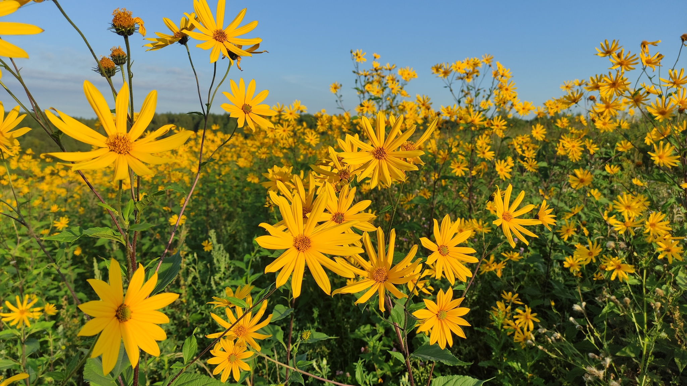

Perhaps most interestingly, Asteraceae is also one of the evolutionarily newest families of flowering plants. They
likely evolved in southern South America around 83 million years ago, with the oldest fossil evidence being 66 million
year old grains of pollen found in Antarctica. Their present-day distribution still reflects this, with centers of
diversity in South America and southern Africa. This makes them probably the most recent of the major plant families.
This raises a question: How did one of the world’s newest plant families become the most diverse?

#+CAPTION: /Arctanthemum integrifolium/ growing in [[https://en.wikipedia.org/wiki/Quttinirpaaq_National_Park][Quttinirpaaq National Park]] at about 82°N. Flowering plants become rare north of about 75°N. Photo credit: [[https://commons.wikimedia.org/wiki/File:Chrysanthemum_integrifolium_1997-08-05.jpg][Ansgar Walk]], CC BY-SA 2.5.
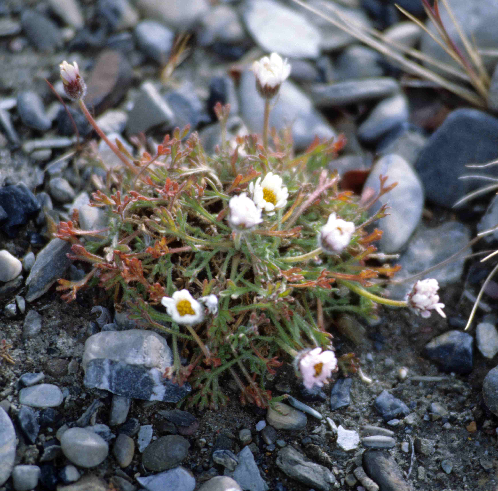
* II.
It might help to define what exactly characterizes the family Asteraceae. The defining trait of the family is their
composite flower heads, giving rise to the older name Compositae. What looks like a single flower is actually dozens to
hundreds or sometimes thousands of tiny flowers all growing together.

#+CAPTION: Unidentified /Helianthus/ sp., most likely a wild type /Helianthus annuus/, the common sunflower. Photos by the author unless otherwise credited, CC BY-SA 4.0.
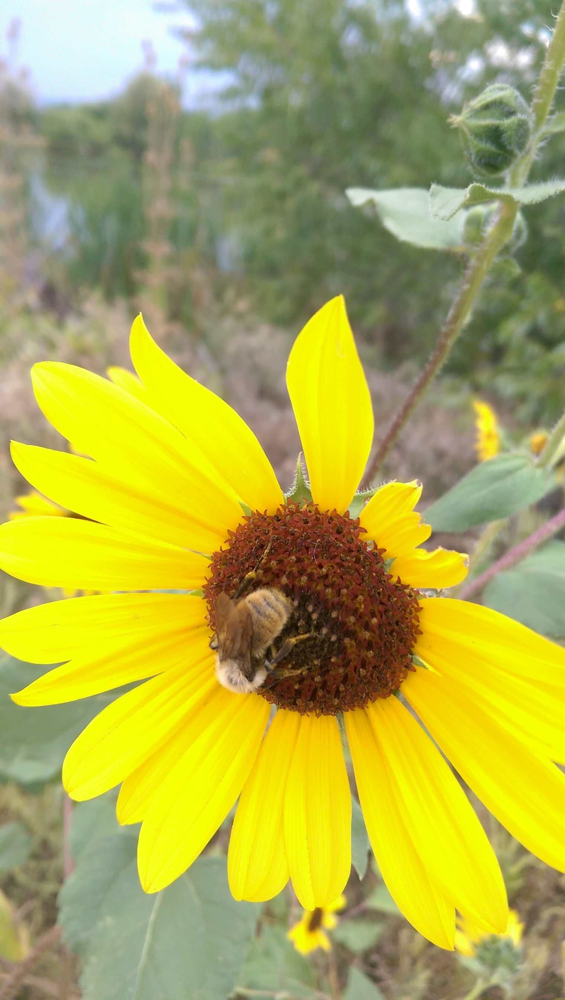

Consider the picture above. This is, perhaps surprisingly, not a flower. It is what is known as a capitulum or
pseudanthium[fn:: Pseudanthium means any inflorescence that resembles a flower; as far as I know capitulum is the exact
same thing but the term is mostly used specifically to refer to composite flowers in the Asteraceae. They have a lot of
unique terminology.], a bunch of tiny flowers arranged in such a way as to mimic one larger flower. If you zoom in, it’s
actually pretty easy to notice all the individual flowers (called disc flowers or disc florets) in the center of the
“flower” (capitulum). They still all have 5 petals and look more or less flower-like. In sunflowers this is pretty
easily visible, but the disc flowers can be even smaller and more reduced in other genera.

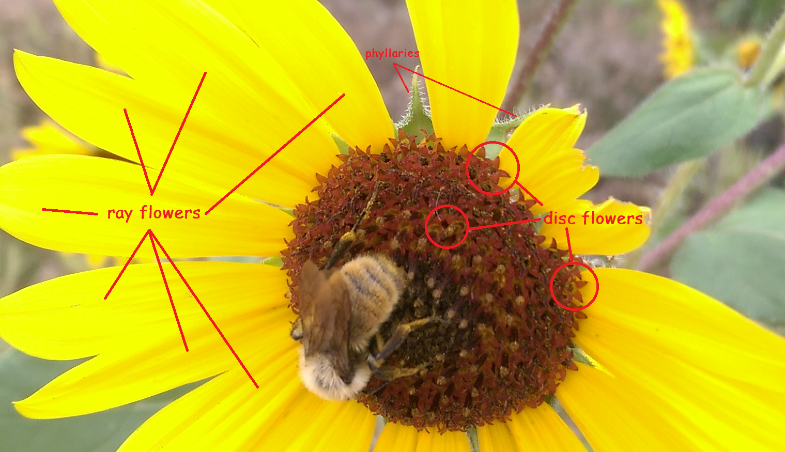

Even more surprisingly, what look like the petals of the capitulum are /each their own independent flower/ (known as a
ray flower or ray floret) with its petals fused into one single macro-petal called a ligule. Generally, the ray flowers
start with five petals and three fuse to form the ligule, while two remain very small.[fn:: In the [[https://en.wikipedia.org/wiki/Barnadesioideae][Barnadesioideae]],
probably the most basal group within the family, four of them fuse instead and leave only one unfused.]

At the base of the flower is a structure called an involucre made up of modified leaves called phyllaries[fn:: This type
of modified leaf is more generally called a bract. Phyllaries are just the type of bract specific to the Asteraceae.].
The involucre is often one of the more important parts of the plant for identifying species within the Asteraceae.

The role of the ray flowers is one of the primary degrees of variation within the Asteraceae. Some tribes[fn:: In
plants, taxonomic divisions below the family level go subfamily → tribe → subtribe → genus → species. Because the
Asteraceae family is so huge, tribes are fairly important in their internal taxonomy.] lack ray flowers entirely.
Thistles are a common example of this.

#+CAPTION: /Cynara cardunculus/ (artichoke). Photo credit: [[https://www.inaturalist.org/observations/147041946][Awhesian]], CC0.
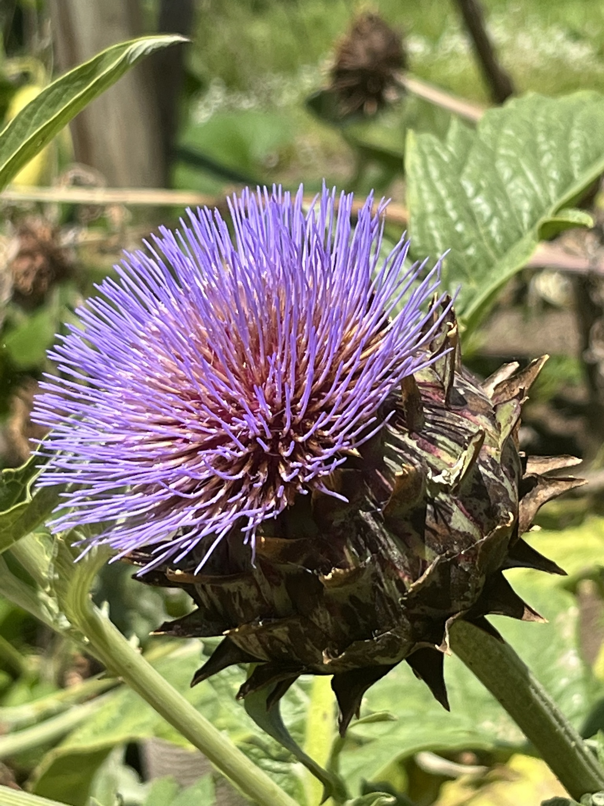

In the artichoke photo above, the purple hairlike structures are the disc flowers, the bulbous green part is the
involucre, and ray flowers are entirely absent. This type of capitulum is known as /discoid/. In discoid heads the disc
flowers are all bisexual (have both male and female reproductive structures).

#+CAPTION: /Erigeron speciosus/ (probably)
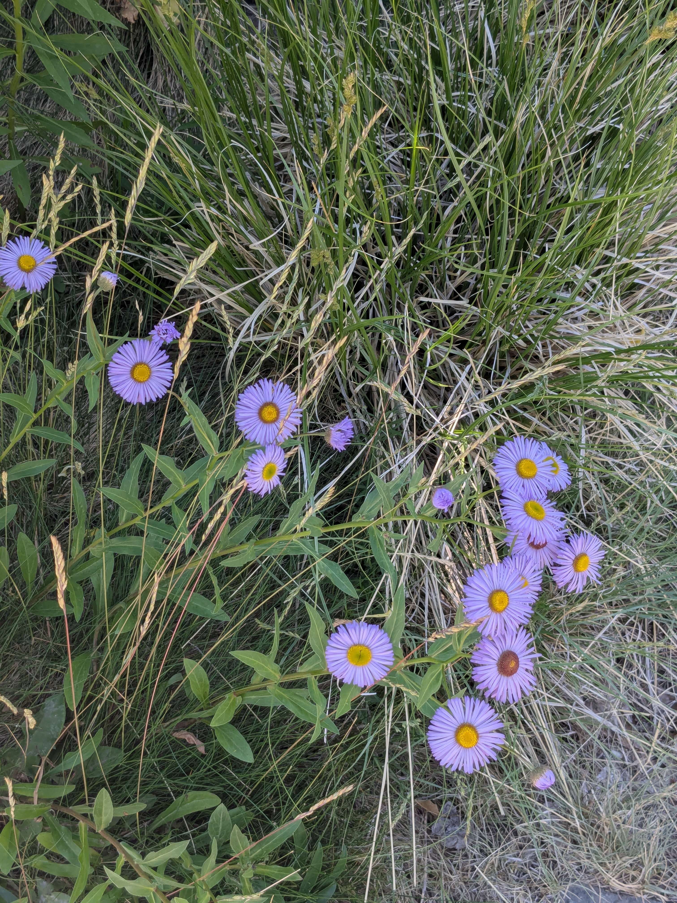

Flower heads with both ray flowers and disc flowers, like sunflowers or the /Erigeron speciosus/ above, are called
/radiate/. In radiate heads the disc flowers are bisexual and the ray flowers are either sterile with reduced vestigial
reproductive structures, or pistillate (female).

#+CAPTION: /Taraxacum officinale/ (common dandelion)
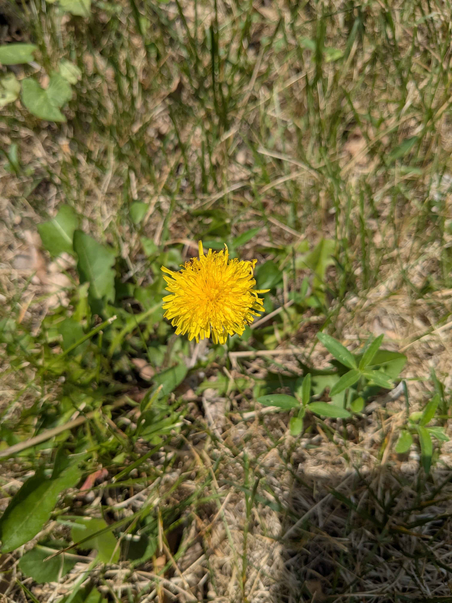

Exclusive to the tribe Cichorieae (including lettuce, dandelions, and chicory) are /ligulate/ heads, consisting of a
single type of flower called ligulate flowers. Ligulate flowers are superficially very similar to ray flowers but they
form differently, with all five petals fusing to form the ligule. This usually results in noticeable “teeth” at the end
of the ligule, which represent the tips of the original petals. While ray flowers are either sterile or pistillate,
ligulate flowers are all bisexual. Ligulate flowers are not found outside of the Cichorieae, but are universal within
that tribe. This is why dandelion seed heads look the way they do; each “petal” of the dandelion is an independent
flower which turns into a seed.

#+CAPTION: Dandelion teeth. Each one of the teeth is homologous to a petal on a normal flower. On species outside the Cichorieae you can sometimes find three teeth instead of five, but in my opinion they are usually less prominent.
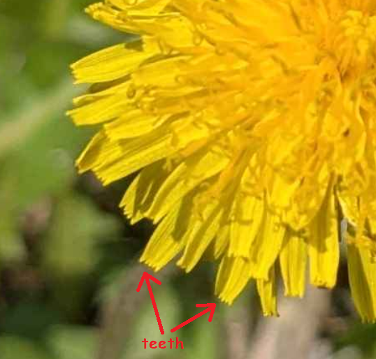

There are some minor subtypes of these head types as well, usually specific to various genera. There is also a
surprising amount of variation in head type sometimes even within a species; however the genetics controlling the
development of ray vs disc flowers works out it seems possible for mutations to occasionally result in individuals with
a different type of flower head than is usual for that species. Many cultivated chrysanthemums and dahlias, for example,
have a mutation causing many or all of the disc flowers to turn into ray flowers.

#+BEGIN_EXPORT html
<figure class="imggroup">
#+END_EXPORT
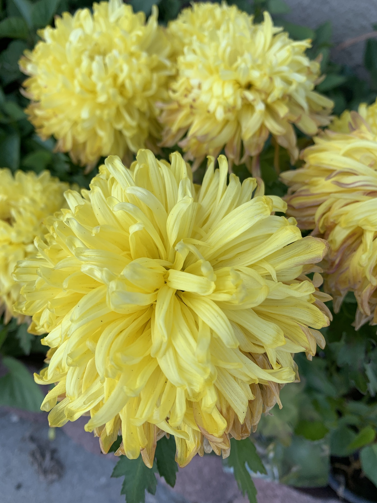
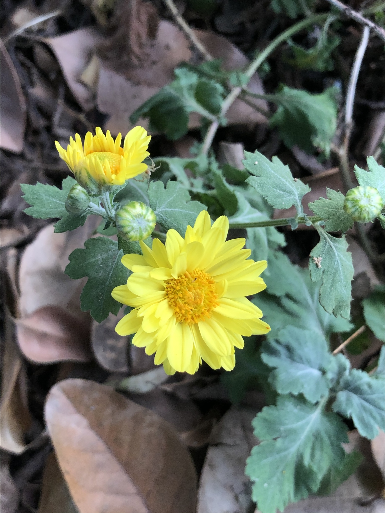
#+BEGIN_EXPORT html
<figcaption>
#+END_EXPORT
Left: /Chrysanthemum/ (probably /Chrysanthemum × morifolium/) mutated to have few or no disc flowers. Photo credit:
[[https://www.inaturalist.org/observations/71173999][thowyn]], CC BY-NC 4.0. Right: /Chrysanthemum × morifolium/ without the mutation. Photo credit: [[https://www.inaturalist.org/observations/65883427][Wai Shing]], CC BY-NC 4.0.
#+BEGIN_EXPORT html
</figcaption>
</figure>
#+END_EXPORT

#+CAPTION: Cultivated /Dahlia/ mutated to have significantly more ray flowers (some disc flowers still visible in the center). Photo credit: /Needy Girl Overdose/ (anime).
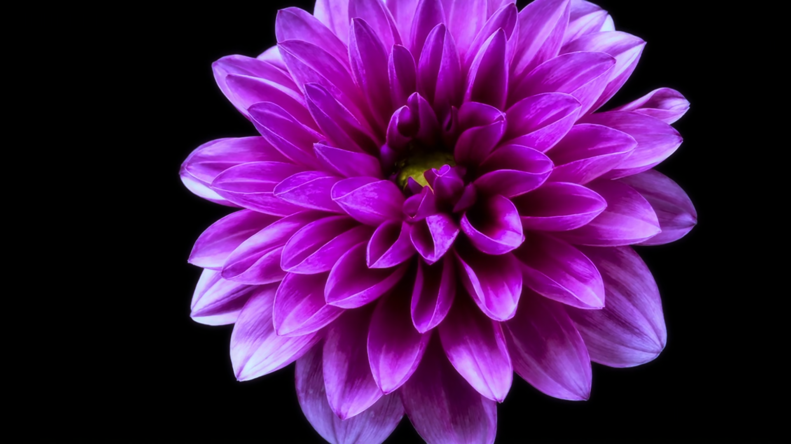

In all types of capitulum, each ray or disc flower produces exactly one seed (unless the ray flowers are
sterile).

Composite flowers are entirely unique to this family and represent a significant evolutionary innovation. This is one of
the key components to understanding their success.
* III.
Composite flowers are the most obvious evolutionary development in the Asteraceae, but not the only one. Generally,
theories of why these plants are so successful focus on three major factors:

1. Composite flowers
2. Storing energy as inulin rather than starch
3. High diversity of secondary metabolites
** Composite flowers
The mention of sterile ray flowers above may have raised a question: If ray flowers are (sometimes) sterile, what is the
point of them? In fact, what is the point of composite flowers at all?

In order to attract insect pollinators, a plant has to present some structure that at least kind of looks like a flower.
Flowering plants and insects have been evolving together for at least 130 million years, and generally the evolution of
flowers is constrained by what insects will pollinate.

Composite flowers, while looking enough like regular flowers to still attract pollinators, provide a few advantages over
standard flowers. This mostly comes down to the individual flowers being very small and cheap to produce.

One advantage is that because the “petals” are shared among many tiny individual flowers, the energy required to produce
each individual disc flower is very small. Petals are pretty useful for e.g., visibility to pollinators, providing a
place to land, etc.[fn:: This does raise the question of how Asteraceae species with discoid heads perform those
functions. I don’t know if they attract fewer or different pollinators than the other types of composite head.] In this
way composite flowers can look enough like a flower to fulfill those functions, but the energy cost required to make
petals is amortized across many independent flowers. Similarly, the phyllaries of the whole head take over the
protective functions of sepals, so the calyx[fn:: Collection of sepals (which are the petal-shaped leaf-like things
below the petals of most plants).] on individual flowers instead develops into a modified calyx structure called a
pappus. The pappus can either be extremely reduced, if not absent entirely, or it can function as a mechanism to help
disperse the seeds. For example, in dandelions the pappus develops into a parachute structure to support wind dispersal.
In some species the pappus develops into burs for mechanical dispersal. Repurposing sepals into efficient seed dispersal
mechanisms is probably another minor factor in Asteraceae success.

There’s some inherent redundancy in having a lot of little flowers too. Even if the composite flower head is severely
damaged there will most likely still be some individual flowers that are intact and fully functional.

Finally, by having many tiny flowers packed together, if a pollinator lands it will almost always pollinate more than
one individual flower. Having a lot of small flowers that each produce one seed is better for genetic diversity than
having one big flower that gets pollinated once and produces many seeds.

In general, the pollination efficiency of composite flowers is very high, and because plants are mostly dependent on
insects for their reproduction this turns out to be a very important advantage.
** Inulin
Most plants store energy as starch. One of the characteristic developments of the Asteraceae is that they typically
store energy as inulin (not to be confused with in​*s*​ulin) instead. Inulin is one member of a broader class of
carbohydrates known as fructans, which are polymers of fructose.

Fructans pop up in various plants and generally seem positively selected for. While the exact advantages conferred by
fructans are not known, they at least seem to stabilize cell membranes under drought and freezing conditions.[fn::
[[https://pmc.ncbi.nlm.nih.gov/articles/PMC2705711/]]] This is very likely a factor in the dominance of Asteraceae in
arid/semi-arid regions and why they are comparatively less common in rainforests.

Interestingly fructans are also quite common among the Poaceae (the grass family), which are also quite hardy plants and
share a lot of habitats with the Asteraceae.
** Secondary metabolites
Secondary metabolites are any compounds a plant produces that aren’t directly involved with growth or reproduction, so
basically anything other than carbohydrates and proteins. Plants produce a /lot/ of chemicals; they are basically little
chemical factories with infinite energy as long as they don’t get eaten. To that end many plants produce a variety of
secondary metabolites usually for purposes like discouraging insects and herbivores from eating them. Caffeine and
nicotine for instance are both secondary metabolites produced by plants as insecticides. Sometimes secondary metabolites
serve other functions too, like attracting insects to flowers.[fn:: You could do worse than assuming that everything
plants do is either to attract insects or to repel insects.] [[https://pmc.ncbi.nlm.nih.gov/articles/PMC4521368/][Caffeine probably improves the memory of bees.]]

Many Asteraceae species produce a very wide variety of secondary metabolites. Some of these, like [[https://en.wikipedia.org/wiki/Sesquiterpene_lactone][sesquiterpene
lactones]], are bitter and toxic to insects and herbivores. Others are allelopathic and inhibit the growth of competing
plants. Sunflowers, for example, produce a variety of compounds in their roots, leaves, and seeds that significantly
slow the growth of other plants. This is fairly common across the Asteraceae.

[[https://en.wikipedia.org/wiki/Artemisinin][Artemisinin]], the current gold standard treatment for malaria, is a secondary metabolite from the Asteraceae species
/[[https://en.wikipedia.org/wiki/Artemisia_annua][Artemisia annua]]/ (a plant closely related to tarragon and wormwood).

#+CAPTION: /Artemisia tridentata/
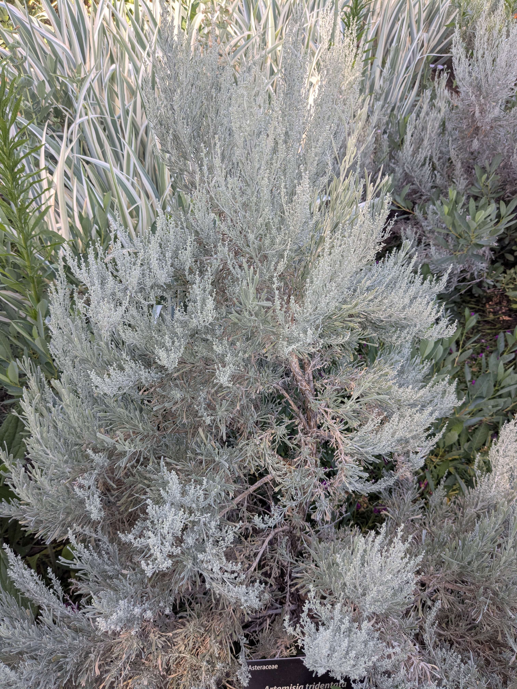

It’s worth noting that the highest diversity of compounds is found in the Asteroideae subfamily, which accounts for
about 70% of Asteraceae species.[fn:: https://www.sciencedirect.com/science/article/abs/pii/S105579031600083X] It’s
possible that aggressive secondary metabolites are actually the primary driver of Asteraceae success and diversity, even
more than composite flower heads or inulin.
* IV.
Remember when I said there are 32,000 Asteraceae species? Unfortunately that number varies pretty wildly depending on
how you count species. Lower estimates are in the 23,000 – 25,000 range. That is still very high, but probably smaller
than the number of orchid species for instance. (On the other end, the highest estimates for Asteraceae are around
35,000.)
** Dandelions
A large part of the variation in estimates is due to two genera: the genus /Taraxacum/ (the dandelions) and the closely
related genus /Hieracium/ (common name hawkweeds). /Taraxacum/ has somewhere between 60 species and about 2800. The NCBI
lists [[https://www.ncbi.nlm.nih.gov/Taxonomy/Browser/wwwtax.cgi?id=49743][around 500]], with names like [[https://www.ncbi.nlm.nih.gov/Taxonomy/Browser/wwwtax.cgi?command=show&mode=node&id=1522236&lvl=3][“Taraxacum sp. JS 8127”]] that feel oddly reminiscent of synthetic cannabinoids or the
difficult-not-to-misread [[https://www.ncbi.nlm.nih.gov/Taxonomy/Browser/wwwtax.cgi?command=show&mode=node&id=525223&lvl=3][“Taraxacum sp. Sojak 725”]]. /Hieracium/ is even worse: anywhere from 250 species to [[http://www.efloras.org/florataxon.aspx?flora_id=1&taxon_id=115448][over 9000]],
although probably no one accepts the latter number as it is. Typical estimates put these genera both somewhere in the
low thousands, which still puts them among the largest genera of flowering plants.

The problem is that these are some of the few plants were asexual reproduction is rampant. (And some of even fewer that
do it from seed; some plants reproduce by budding off clones of themselves, but dandelions and hawkweeds can produce
fully viable seeds asexually, which is very unusual.) As a reproductive strategy this works very well: they can use
sexual reproduction to reap the benefits of genetic diversity, or a plant that is particularly well adapted to its local
environment can quickly spread clonally. Because each individual ligulate flower is independent from the other ones
they’ll usually produce some mix of sexually and asexually produced seeds.

Unfortunately, it can make species boundaries somewhat difficult to determine, since some authors count each local
clonal population as a distinct species or subspecies, and others try to figure out which of these are just particular
clonal lineages of the same actual species.
* V.
All of this results in very well-optimized plants that reproduce fast and aggressively. Many Asteraceae species are
extremely weedy, and they’re often some of the first plants to colonize disturbed soil.

Dandelions are a pretty good example of this. Their asexual reproduction combined with their wind-dispersed seeds means
they can reproduce from anywhere and spread quickly, even with no other dandelions around. Once they’re established they
grow as a hardy perennial with a taproot that stores energy in the form of inulin. On top of that, they produce
allelopathic secondary metabolites in their pollen that interfere with the seed development of other plants if an insect
carrying dandelion pollen pollinates another flower.[fn:: https://pollinationecology.org/index.php/jpe/article/view/286]
There’s a reason they grow everywhere.

That said, they’re not at all limited to only being small and fast herbs. There are quite a few longer-lived shrubs, and
while trees are fairly rare among the Asteraceae there are even some of those too.

#+CAPTION: /Ericameria nauseosa/, a very drought-tolerance shrub from western North America.
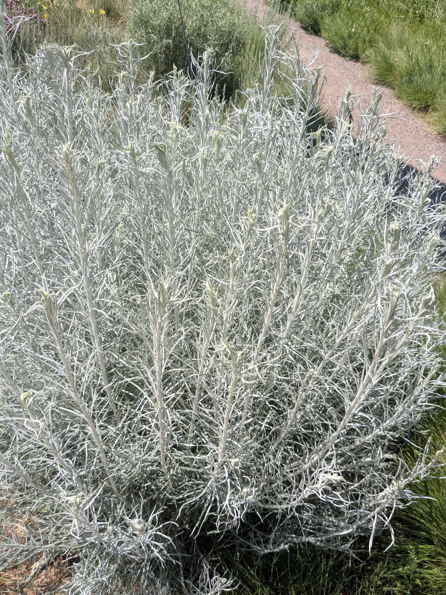

All of these major adaptations can confer substantial advantages across a variety of environments. To answer the
original question—why are there so many Asteraceae species in spite of the family being much younger than some other
families of plants—the answer is probably just that they hit on a few highly successful generalist adaptations that make
it easy for them to adapt to a wide variety of environments, driving speciation. Inulin in particular seems to greatly
aid them in adapting to cold and/or dry environments and composite flowers are a fairly major evolutionary innovation
over standard flowers which is useful everywhere. Aggressive secondary metabolites help them out-compete everything
else.
* VI.
So why do I like these plants so much?

Well, mostly I just think they look nice. I like the color yellow. They often attract a lot of insects which I like to
watch. Sunflowers are really iconic in Japanese media. That’s about it really. From the perspective of engineering
aesthetics I tend to like well-built generalist solutions that are fairly standard with a small number of ‘tricks’ that
have an outsized impact relative to their added complexity over anything too elaborate or specialized and thus I find
the extreme weediness of a lot of Asteraceae species somewhat appealing. You can also find them anywhere; you can get
out on the side of a highway and you’ll probably find some kind of Asteraceae growing there.

#+CAPTION: /Cosmos bipinnatus/ (common cosmos). Photo credit: [[https://www.inaturalist.org/observations/339548283][esb26066]], CC BY-NC 4.0.
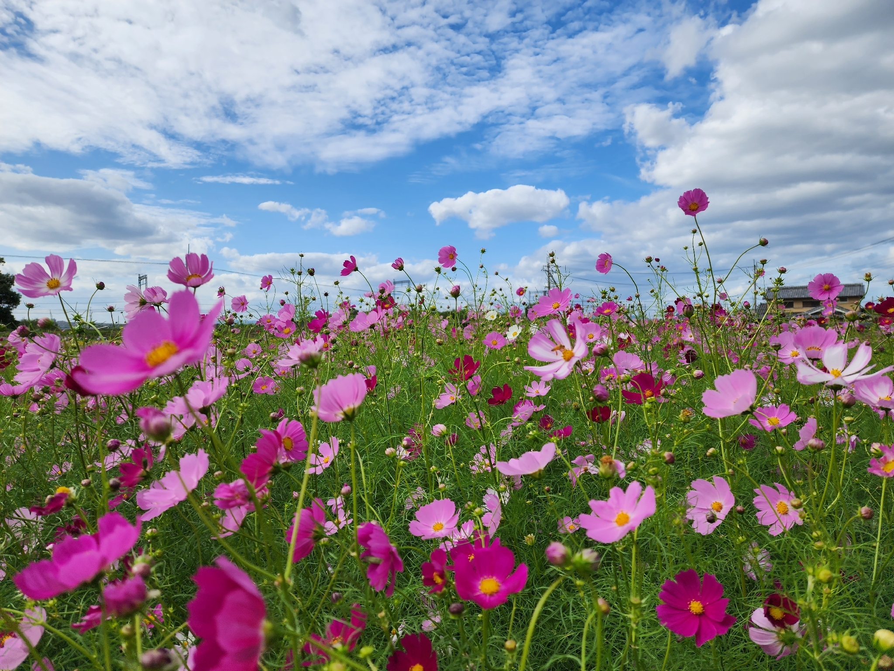

I like that the flowers are both very pretty and (to me at least) intellectually interesting too. They’re very different
from most other plants, and there’s a lot of room in the composite flower design space and different Asteraceae species
do explore it. This whole post was motivated by me wondering what it was about composite flowers that made them so
evolutionarily successful, and then finding out it might not even be the composite flowers themselves, or it might be a
mixture of benefits from the composite flowers plus regular old chemical warfare.

I really like subantarctic islands and also the High Artic and it’s neat that they’re found in both places. There are
also a lot of them in the more arid parts of western North America, which I have a bit of a bias towards.

One sort of weird trivia is that Asteraceae species tend to have numbers of ray flowers distributed according to the
Fibonacci sequence (this actually isn’t too uncommon for true petals in other families of plants either, but usually
they have fewer). Sunflowers take this even further and their disc flowers are arranged in alternating spirals where
each disc flower is rotated from the previous by π(3 - √5) rad (i.e. the golden angle). The number of clockwise and
anticlockwise spirals are two successive Fibonacci numbers, typically 34 – 55, 55 – 89, or 89 – 144. This arrangement
produces the mathematically optimal packing of seeds within the flower head, which I think is neat.

Anyway, 10/10 family of flowering plants, I think they’re super interesting, and hopefully now you do too, or at least
maybe you’ll have a renewed appreciation for sunflowers and miscellaneous noxious weeds. And next time you’re out in
nature, maybe take a look for them—I think it’s one of the easiest families of flowering plants to identify. Once you’ve
seen the major types (discoid/radiate/ligulate) the composite flowers have a pretty specific look to them and aren’t
really easily mistaken for anything else. Distinguishing one from the other though, well, there’s a reason they call ’em
damn yellow composites.

#+CAPTION: I don’t actually know what this is.
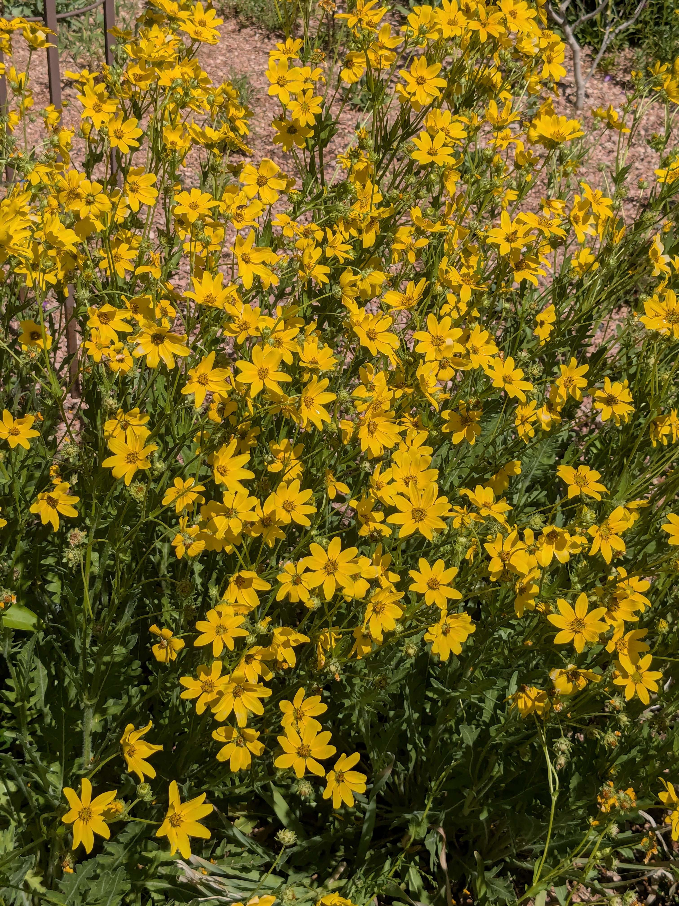
