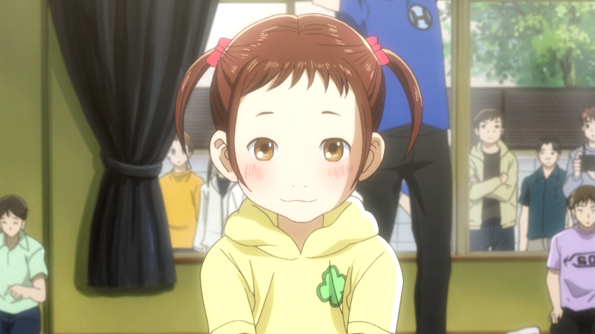
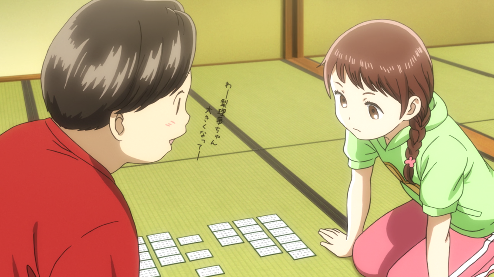
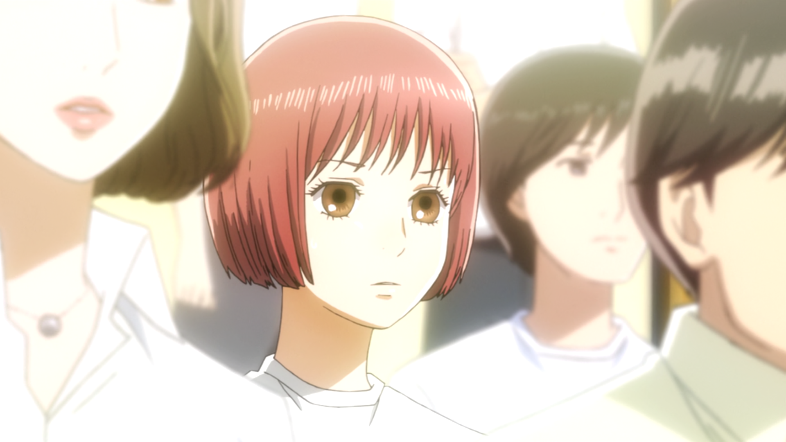
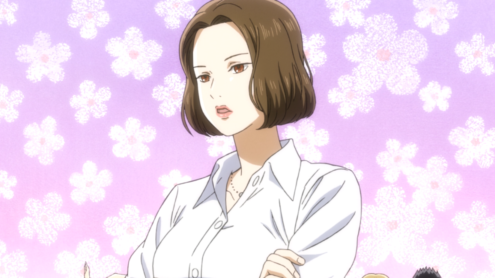

#+TITLE: Anime review: Tihayafuru
#+AUTHOR: pecan
#+DATE: TBD
#+BLOG_TAGS: review anime

This is going to be a bit of a different review format because Tihayafuru does a lot of things that I specifically
really like so I'm just going to sperg about the things I like about it so much. Other media also do these things, but
it's extremely rare to have something that combines so many specific things and does all of them so well.

You can think of this as less of a review and more like… “if you know of anything else that combines multiple of these
specific things and does them really well I'll probably like it a lot”. There is no coherent theme here, just me jumping
around between a bunch of different things I thought were notable about the show and particularly liked about it.

* refile
To be clear, I do not think Tihayafuru is an especially tight or well-planned-out show from a macro plot level and it
does feel like it flounders occasionally where the author wasn't quite sure about what to do. This also doesn't really
matter, because it's carried by GOD TIER sports writing and GOD TIER character writing.

something about the beginning and everything just kinda going tihaya's way for a while
* Recurring characters
There are nearly no voiced characters in Tihayafuru that only show up once.

#+BEGIN_EXPORT html
<figure class="imggroup">
#+END_EXPORT

#+BEGIN_EXPORT html
<figcaption>It's really dedicated to this; for example this girl who appears for one important scene in season 1 shows up again in season 3 (well over a year later) and has physically grown.</figcaption>
</figure>
#+END_EXPORT

One other common technique it uses is to show a character in the background (for example a spectator at a tournament),
then have them feature prominently in a later arc, and then instead of just fading away they /continue to show up
frequently/.

#+CAPTION: Rion shows up in the audience well ahead of her actual arc, and then she continues to figure in scenes for the entire rest of the show.

I think the format of karuta helps with this, since multiple games are played at the same time you can have one of the
major matches of the arc and in the background have some other important character playing some side character and you
pog out a bit recognizing them from before.

It's also easy because a lot of the characters are really weird and immediately identifiable. You never lose track of
anyone because their quirks are so strong and recognizable. They usually have some unique ways of playing karuta too.

I think this is great, because

Or like, when it introduces a strong player /of course/ they're going to keep showing up at tournaments, even if they
don't win or otherwise really affect the course of the story, it's just really cool that you're gradually introduced to
the competitive karuta circuit and it actually is a circuit. It feels a lot like when you're a competitive chess player
and you have your rivals that you play frequently, some kinda zako guys you know you can beat, various familiar faces
you don't play often but you've seen around before, etc, and at some point you recognize most of the bracket. By the end
of Tihayafuru you really get a good idea of the majority of high-level karuta players.

The side characters start to have important relationships and rivalries and history with each other too. Sakurazawa, who
by the end is one of my favorite characters in the series, starts out only as the coach for one of the high school
teams. Not only does that team actually show up often for the rest of the series, but Sakurazawa turns out to have
another major role entirely unrelated to her as a high school coach; she was a major rival to one of the other important
side characters in the past and /actually still actively plays karuta at a high level/. She isn't just tied to one arc
or another but crosses through the karuta world in multiple generations.

#+CAPTION: I seriously thought this woman was just going to show up for her team's arc in the team championships and I was bemoaning that we'd never see her again after it was over. Glad I was very wrong.

** TODO mention concentric circles here?
* The karuta metagame
* The personality of the characters
* Kid flashbacks
I am very weak to kid flashbacks. If anything I think it could have exploited this more, but the formula of “start with
a flashback to the characters as kids setting up the fundamental drama and then repeatedly reference it periodically” is
a winning combination so I think this aspect is really good.
* Character designs
They're all really good. Seriously I think in terms of consistent quality across a huge number of designs this is one of
the best of anything. They're all easily identifiable, match the characters' personalities well, they're cute, they're
hot, generally just pleasant to look at and definitely helps with keeping every character memorable.

The synthesis of visual design + personality/speech style + style of playing karuta + voice acting is really well done
for each character and each aspect matches the others perfectly to form a coherent Gesamtkunstwerk. They all look so
distinct and combined with each having unique quirks it's really easy to remember everyone even though there are dozens
and dozens of relevant characters. Like Sinobu just kind of /looks/ like the type of character that would play karuta
the way she does, and she plays karuta like the type of character that would have the voice she does, and she has the
voice that a character that looks like that would obviously have. It all integrates together really well. This is not
only helpful but arguably kind of necessary for the series to work at all given how many different characters there are.

[INSERT IMAGES OF A BUNCH OF CHARACTERS HERE]
* Sakurazawa Midori
Though she's only introduced around halfway through the second season Sakurazawa Midori pretty quickly became one of my
favorite characters in the show. I confess this is partly just because I think she is insanely hot, but only partly.
She's just a Cool Adult Character with an interesting personal arc and I also think her rising prominence in season 3 is
kind of emblematic of the greater focus on the adult players in that season more generally, which has some of the high
points of the entire show IMO. She's also pretty impactful on Tihaya personally, almost directly inspiring Tihaya to aim
to become a teacher and at least have some kind of plan for the future. To be honest the way this plays out feels a
little bit sudden, like the mangaka just kind of had the idea at some point and realized it made a lot of sense so it
feels kind of like it came out of nowhere (albeit not completely out of nowhere, and again it makes complete sense that
she was inspired by Sakurazawa and Miyauti, the development just happened really fast). This is maybe slightly
inharmonious with the fact that prior to that she was just 100% full speed ahead queen mode and I feel like if the
mangaka had thought of it sooner the teacher thing probably would have come up earlier. That aside, I think it's a cool
development that this one side character who started off as just a coach in the background during the high school
tournament ended up affecting Tihaya's life so much and it really shows how dynamic the world is and how interconnected
all the character relationships are. Another example of that is Sakurazawa also serving as a past rival for Inokuma and
now supporting her in the present. Sakurazawa fills so many different roles in the series that I find her a really good
example of the strengths of the world and character building and also an extremely likeable character in her own right.

Also her voice acting is God-tier. I don't know how the VA managed to keep that up for every line. It's tremendously fun
to listen to. Unrelatedly, every time she says 体力 it's the most erotic voice line ever to grace an all ages show.

[IMAGES]
